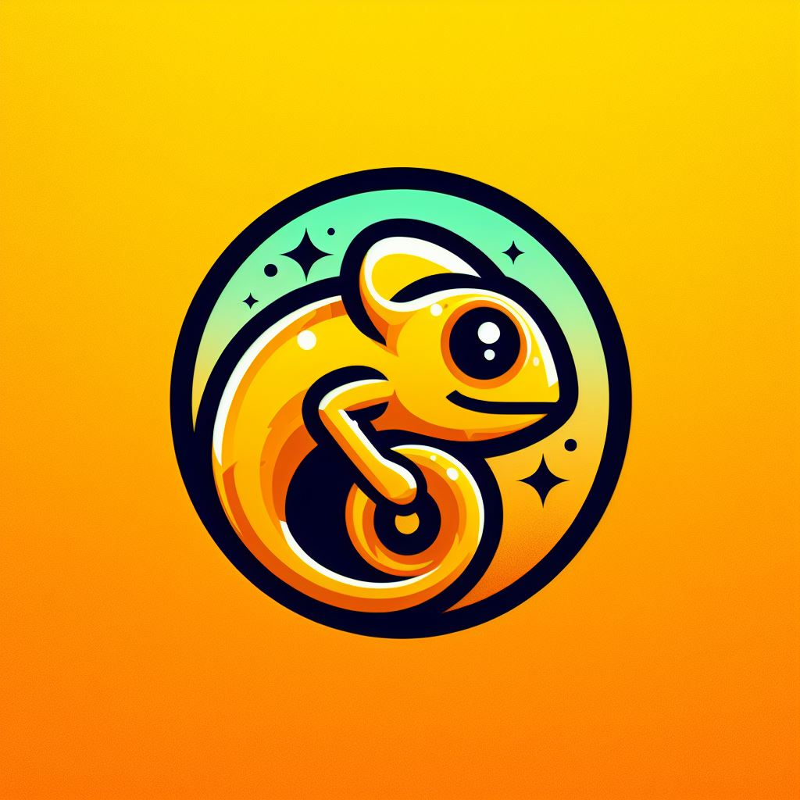

# Gold - The programming language

Hello, first at all this language is made for fun and research purpose, you can use it if you want.

Gold is heavily inspired by Monkey from the books of Thorsten Ball. The first version of Gold will
follow its guideline in "Writing An Interpreter In Go" and "Writing A Compiler In Go" plus some
addition of myself. I will list my modification in change logs, thus after completed these books
I will modify this language to my please, which also will be noted in the changes logs.

## Monkey base

Here's list of addition of my self

- '<=' and '>=' are classic comparator that return bool value
- FLOAT are float64 and support operation between integer in float which will convert to float64 no matter the result
- 'x++' and 'x--' return the value of the identifier then increment of decrement
- '++x' and '--x' increment or decrement then return the value
- while loop

